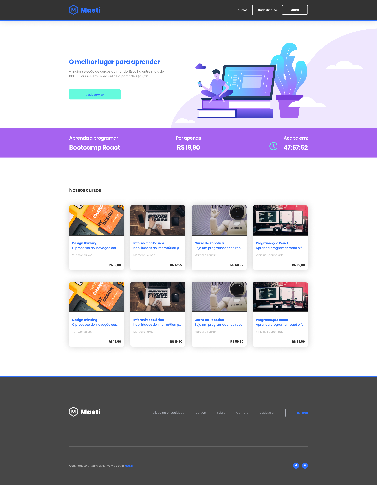

<h1 align="center"> Masti </h1>

Projeto do Boootcamp da Masti de ReactJS.  
 

  

## 🚀 Tecnologias

Esse projeto foi desenvolvido com as seguintes tecnologias:

- React JS com Vite
- TypeScript
- Tailwind CSS, RaidxUI
- Figma

## 💻 Projeto

O site é uma plataforma de cursos de tecnologia. para rodá-lo basta digitar o comando npm run dev na pasta web/ e npm start na pasta server/

## 🔖 Layout

Você pode visualizar o layout do projeto através [DESSE LINK](https://www.figma.com/file/PG4WhjKXfZGdI0b5KGDYyG/Bootcamp-Masti?node-id=0%3A1). É necessário ter conta no [Figma](https://figma.com) para acessá-lo.
